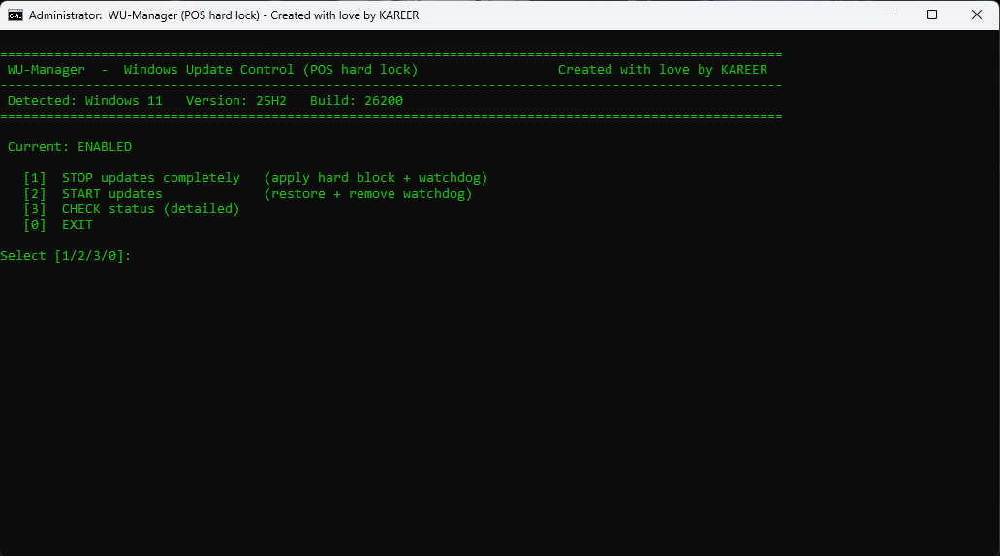

# WU‑Manager — Windows Update **hard lock** for POS

A tiny, battle‑tested batch script to **fully block Windows Update** on Windows 10/11 POS machines (and toggle it back when needed). It applies **policy + services + scheduled‑task** hardening and installs a **SYSTEM watchdog** so the block survives reboots and self‑healing attempts (WaaS Medic, USO, etc.).

> Created with ❤️ by **KAREER**

---

## ✨ Key Features

- **One‑key hard block / restore** — menu‑driven UI with reliable `CHOICE` input.
- **Watchdog** — creates 2 Task Scheduler jobs (SYSTEM):
  - `WU-Guardian` (runs **every 1 minute**)
  - `WU-Guardian_Startup` (runs **at boot**)
  Both call a small guardian script in `%ProgramData%\WU_Guardian\` that repeatedly kills update processes, stops services, and forces their startup type to **Disabled**.
- **Strong policy layer** — writes Windows Update policy keys to disable the UX and point WU to a **dead WSUS** (`http://127.0.0.1:8530`) so scans fail cleanly.
- **Services lockdown** — stops and **disables**:
  - `wuauserv`, `UsoSvc`, `BITS`, `DoSvc`, `WaaSMedicSvc`
- **Scheduled tasks lockdown** — disables common Update/Orchestrator/Medic tasks (e.g. `Schedule Scan`, `USO_UxBroker_*`, `PerformRemediation`, etc.).
- **Smart status screen** — PowerShell table shows Service **Status** and **StartType** + relevant policy values (`NoAutoUpdate`, `UseWUServer`, `WUServer`).
- **Safe admin checks & clear ASCII UI** — works on any console/font; no stray buffered keys.
- **Windows 10 & 11 aware** — detects product and display version for clarity.
- **Idempotent** — you can run the hard block multiple times; the result remains consistent.
- **Clean restore** — removes policy keys, restores services to **Manual**, re‑enables Microsoft tasks, and **uninstalls the watchdog**.

---

## 📦 What this script actually changes

### Registry (Policy)
Creates/sets under `HKLM\SOFTWARE\Policies\Microsoft\Windows\WindowsUpdate` (and `...\AU`):

- `TargetReleaseVersion` = `1`  
- `TargetReleaseVersionInfo` = `<current DisplayVersion>` (e.g., `22H2`)
- `ProductVersion` = `Windows 10` or `Windows 11`
- `SetDisableUXWUAccess` = `1`
- `DisableWindowsUpdateAccess` = `1`
- `ExcludeWUDriversInQualityUpdate` = `1`
- `DisableOSUpgrade` = `1`
- `DoNotConnectToWindowsUpdateInternetLocations` = `1`
- `WUServer` & `WUStatusServer` = `http://127.0.0.1:8530`
- `AU\UseWUServer` = `1`
- `AU\NoAutoUpdate` = `1`

> On **restore**, the entire `...\WindowsUpdate` policy branch is **deleted**.

### Services
- **Hard block:** stop and `Start=Disabled` for
  - `wuauserv`, `UsoSvc`, `BITS`, `DoSvc`, `WaaSMedicSvc`
- **Restore:** set `Start=Manual` and attempt to start them.

### Scheduled Tasks
- **Hard block:** `schtasks /Change /Disable` for tasks in
  - `\Microsoft\Windows\WindowsUpdate\*`
  - `\Microsoft\Windows\UpdateOrchestrator\*`
  - `\Microsoft\Windows\WaaSMedic\*`
- **Restore:** `schtasks /Change /Enable` for the same list.

### Watchdog (Task Scheduler + helper files)
Files created in `%ProgramData%\WU_Guardian\`:
- `guardian.cmd` — enforces the block (kills processes, stops & disables WU services)
- `run.cmd` — wrapper used by the scheduled tasks

Tasks created:
- `WU-Guardian` (SYSTEM, **every 1 minute**)
- `WU-Guardian_Startup` (SYSTEM, **at boot**)

On **restore**, both tasks and the folder/files are **deleted**.

---

## 🖥️ Menu

```
[1] STOP updates completely   (apply hard block + watchdog)
[2] START updates             (restore + remove watchdog)
[3] CHECK status (detailed)
[0] EXIT
```

- **[1] STOP** — Applies all registry, service, and scheduled‑task hardening, installs the watchdog, and runs it once immediately.
- **[2] START** — Removes policy, restores default Microsoft scheduled tasks, sets services back to Manual, deletes watchdog tasks and files.
- **[3] CHECK** — Shows a PowerShell table of service state and the current policy signals; also prints a concise **Current** status:
  - `ENABLED` (updates normal)
  - `BLOCKED (POLICY)` (policy keys forcing WSUS / NoAutoUpdate)
  - `BLOCKED (HARD)` (services disabled + stopped)

---

## ✅ Requirements

- Windows 10 or Windows 11
- Run from an **elevated** command prompt (Right‑click → *Run as administrator*)
- Console width ~108×34 (the script sets this automatically with `mode con`)

---

## 🚀 Usage

1. Copy `WU-ManagerFinal.bat` to the machine.
2. **Right‑click → Run as administrator.**
3. Choose an option:
   - Press **1** to hard‑block updates and install the watchdog.
   - Press **2** to restore normal Windows Update behavior.
   - Press **3** to view detailed status.

> The script calls `gpupdate /force` where appropriate to apply policy immediately.

---

## 🛠️ Processes & tasks it keeps in check

- **Processes:** `MoUsoCoreWorker.exe`, `usoclient.exe`, `WaaSMedicAgent.exe`
- **Services:** `wuauserv`, `UsoSvc`, `BITS`, `DoSvc`, `WaaSMedicSvc`
- **Scheduler:** common Update Orchestrator, WindowsUpdate, and WaaSMedic tasks

---

## 🔒 When should I use a “hard lock”?

- POS terminals and kiosks where **surprise reboots** or background updates are unacceptable.
- Lab/test rigs where you need a frozen state during experiments.
- Networks without WSUS where you still want an effective, reversible “off switch”.

> **Note:** Blocking updates carries operational risk. Apply in controlled environments and maintain an offline patching process.

---

## ♻️ Uninstall / Restore

Just run the script as admin and press **[2] START updates**.  
It will:
- Delete the Windows Update policy branch
- Re‑enable Microsoft scheduled tasks
- Set services to **Manual** and start them
- Remove the watchdog tasks and `%ProgramData%\WU_Guardian` folder

---

## 📄 File layout (created by the script)

```
%ProgramData%\WU_Guardian\
 ├─ guardian.cmd    (enforcer; run by tasks)
 └─ run.cmd         (wrapper used by tasks)
Task Scheduler:
 ├─ WU-Guardian             (SYSTEM, every minute)
 └─ WU-Guardian_Startup     (SYSTEM, at boot)
```

---

## 🤝 License

You may include any license you prefer (MIT recommended). Example:

```
MIT License — Copyright (c) 2025 KAREER
```

---

## 🧭 Notes

- The script uses **ASCII UI** so it works with any font/locale.
- Uses `CHOICE` to avoid buffered key issues in menus.
- Status detection maps service `Start` DWORD to friendly text.
- Designed to be **idempotent** and safe to re‑run.

---

## 📷 Screenshot



