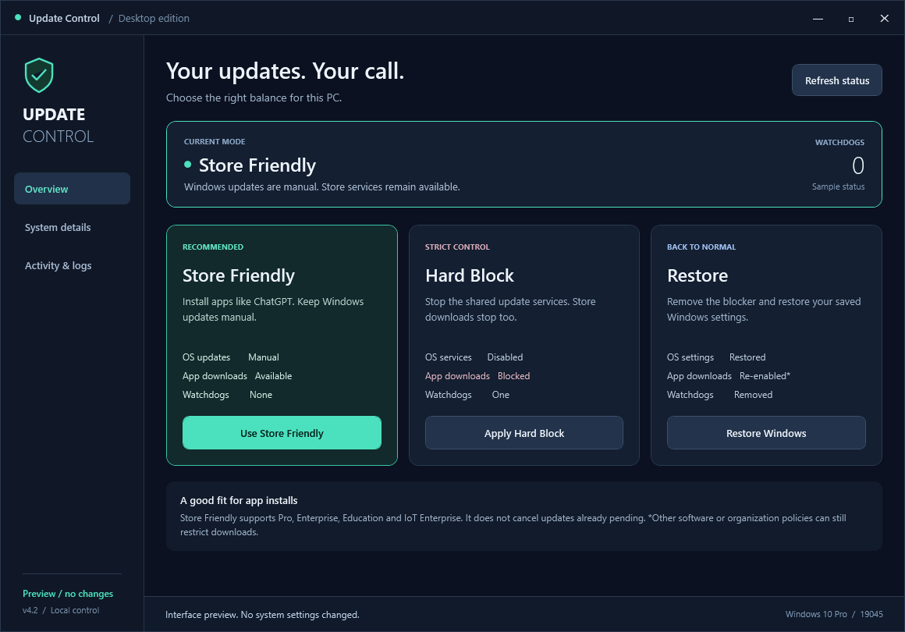
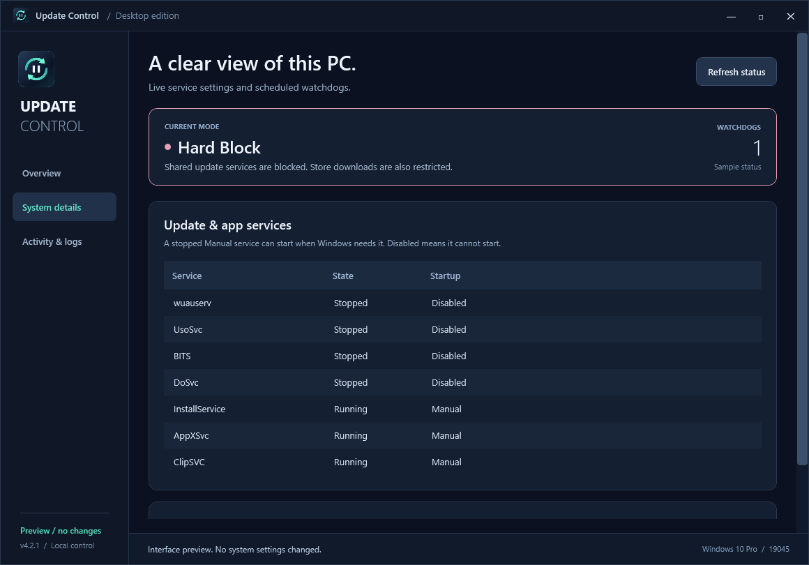
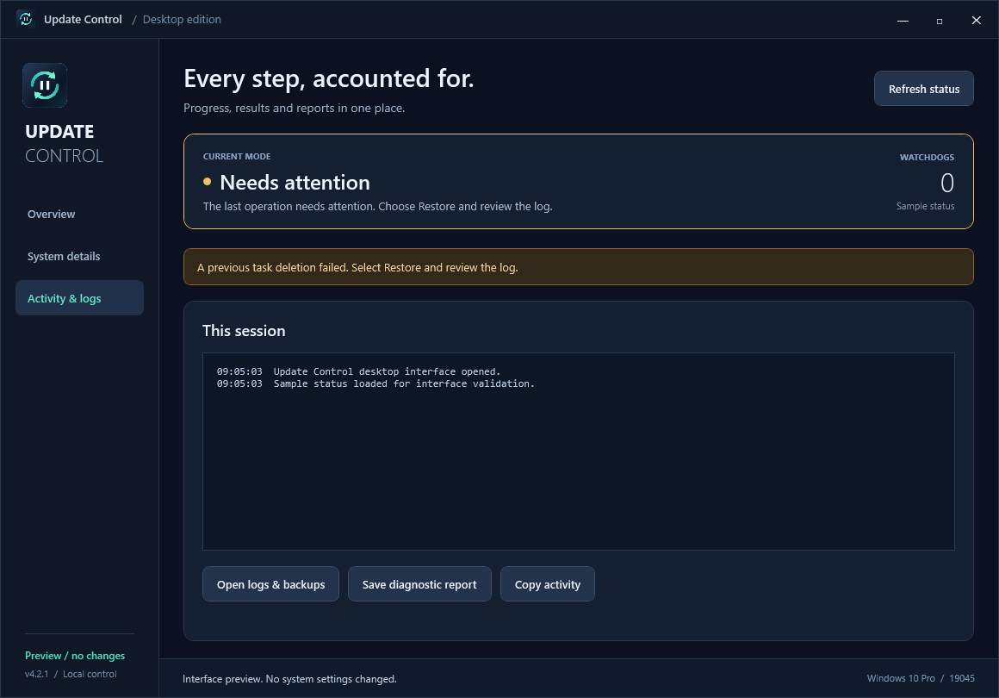

# Update Control Desktop

A Windows desktop interface for controlling automatic OS updates, keeping Microsoft Store available, and removing this tool's blocker reliably.

**[Download the single EXE](https://github.com/ajaykareer/Windows-Update-Manager/releases/download/v4.2.1/Update-Control.exe)** · **[Portable ZIP](https://github.com/ajaykareer/Windows-Update-Manager/releases/download/v4.2.1/Update-Control-Desktop-v4.2.1.zip)** · [Release notes](https://github.com/ajaykareer/Windows-Update-Manager/releases/tag/v4.2.1)

Version 4.2.1 is a preview release. See [validation and limitations](docs/VALIDATION.md) for what is tested.

*Actual WPF interface rendered with sample status. The screenshot is not proof of a live Windows Update block.*

## Start here

1. Download **Update-Control.exe** and open it on the PC you want to manage. Accept the administrator prompt.
2. If you used the old script, select **Restore Windows** first. Follow any restart message.
3. Select **Use Store Friendly** to keep automatic Windows updates disabled by policy while allowing Store downloads, including apps such as ChatGPT.
4. Select **Restore Windows** whenever you want to remove this tool's block.

You download one EXE. It automatically extracts its embedded components into a protected version folder under `%ProgramFiles%\Kareer Update Control`. It uses Windows PowerShell 5.1 and .NET Framework already present on standard Windows 10/11 desktop installations. It does not require Python, Node, or a separate setup wizard.

The EXE is **unsigned**. Windows may display an unknown-publisher or reputation warning. Download only from this repository's release and compare its hash with the release's `SHA256SUMS.txt`. The hash detects a damaged or different download; it does not replace a publisher signature.

For source access, the portable ZIP contains the same components. Extract everything and open `Update-Control.cmd`. Both `WindowsUpdateManager.bat` and the older `WU-ManagerFinal.bat` filename now launch the GUI. A keyboard menu remains available in `Update-Control-Console.cmd`.

## Choose a mode

| Mode | Automatic Windows updates | Microsoft Store | Watchdogs |
| --- | --- | --- | --- |
| **Store Friendly** | Manual-update policy on supported editions | Shared download/install services available | None |
| **Hard Block** | Stops and disables shared update services; best effort | Downloads may fail | One task, with startup and minute triggers |
| **Restore Windows** | Restores the saved settings from before this tool's current blocking session | Removes this tool's restrictions | All recognized legacy/current tasks removed |

**Store Friendly is the recommended mode for keeping app installation available.** It sets `NoAutoUpdate=1`; it is not a complete lock on every kind of update. Manual updates and already pending installations are not cancelled. Organization or MDM settings can override local policy, and known deadline/WSUS conflicts are refused. Windows Home is not offered this policy mode; use Windows Settings' pause controls on Home.

Hard Block also affects BITS and Delivery Optimization, which other applications use. Windows servicing or other administrative software may counteract service blocking. The application does not promise permanent suppression of all updates.

## Reliable removal and recovery

The controller disarms its saved state **before** removing watchdogs. It searches every Task Scheduler folder for the exact names used by previous releases:

- `WU-Guardian`, `WU-Guardian_Startup`, `WU-Guardian_Hourly`
- `POS-WU-Guardian`, `POS-WU-Guardian_Startup`, `POS-WU-Guardian_Hourly`
- `POS-WU-Guardian-v4`

It attempts disable, stop, and deletion independently; retries with the native Task Scheduler command; stops matching old guardian command processes; and verifies that no matching tasks remain. An incomplete removal is an error, not a success message.

A protected baseline preserves original service startup settings and the original automatic-update policy across mode switches. An exclusive operation lock prevents simultaneous mode changes and guardian enforcement. A missing, corrupt, or transitional state never authorizes enforcement. Failed transitions attempt rollback and show **Needs attention**.

Exact original-setting restoration applies to changes first made by version 4. The earlier batch scripts did not save full originals; their migration repair removes recognized restrictions and returns disabled dependencies to runnable settings. Existing unrelated administrator settings are preserved where identifiable.

## Interface

Overview shows the selected mode, watchdog count and available actions. System details shows service and task status. Activity provides progress, logs, backups, and diagnostic reports. Hard Block has a confirmation dialog; failure and restart results are distinct. No restart or Windows Update scan is issued automatically.

| System details | Activity and recovery |
| --- | --- |
|  |  |

## Documentation

- [Build and package from source](docs/BUILD.md)
- [Publisher signing and Windows security warnings](docs/SIGNING.md)
- [Validation coverage and known limitations](docs/VALIDATION.md)
- [Troubleshooting and removing the application](docs/TROUBLESHOOTING.md)
- [Changes in this release](CHANGELOG.md)
- [Quick start included with the application](READ-ME-FIRST.txt)

Windows 10/11 desktop, Windows PowerShell 5.1, administrator access for changes. Store Friendly supports Pro, Enterprise, Education and IoT Enterprise. This project does not change your Windows edition's lifecycle or security support.

Data and backups: `%ProgramData%\POSUpdateControl`. Legacy repair backups: `%ProgramData%\POS_WU_Repair`. Restore before deleting the application or its data.

## Policy references

- [Microsoft: configure Windows Update client policies](https://learn.microsoft.com/en-us/windows/deployment/update/waas-wu-settings)
- [Microsoft: update policy applicability and deadlines](https://learn.microsoft.com/en-us/windows/client-management/mdm/policy-csp-update)
- [Microsoft: troubleshooting Store download failures](https://learn.microsoft.com/en-us/troubleshoot/windows-client/shell-experience/troubleshooting-microsoft-store-apps-download-failure)

MIT licensed. See [LICENSE](LICENSE).
